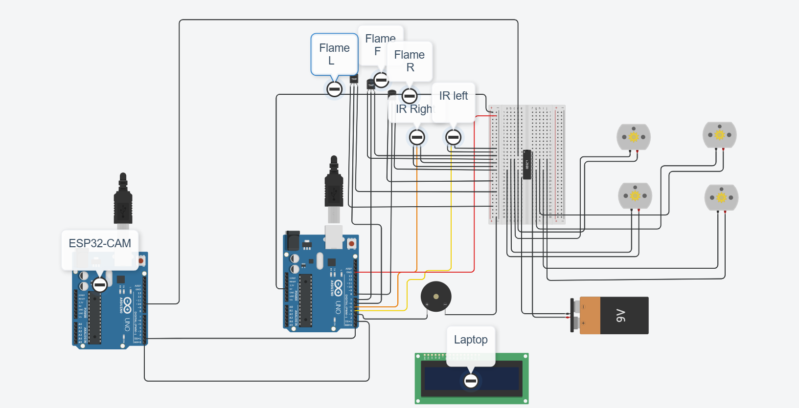
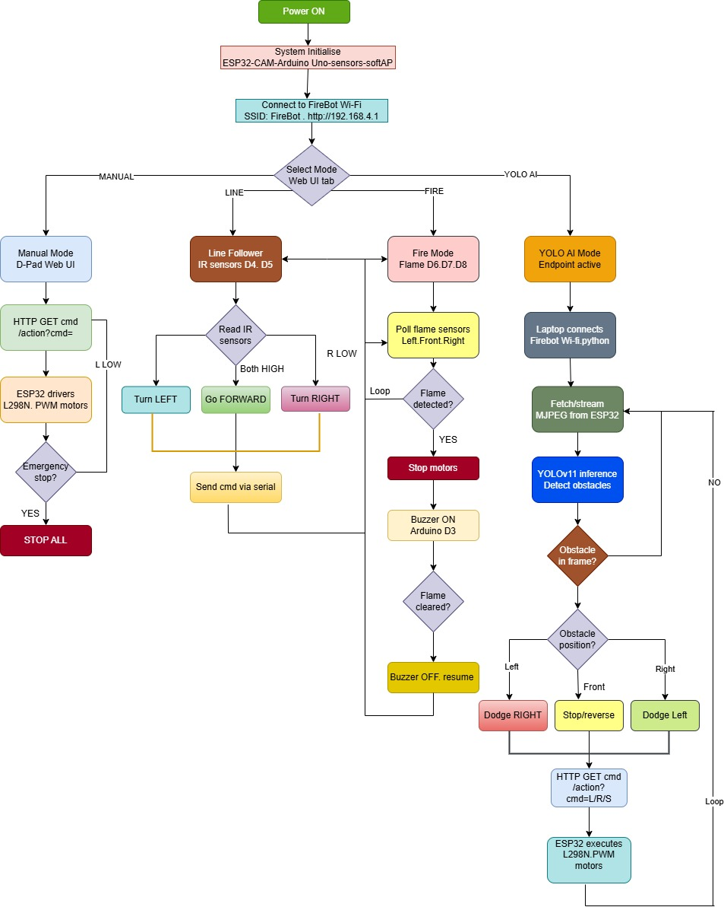
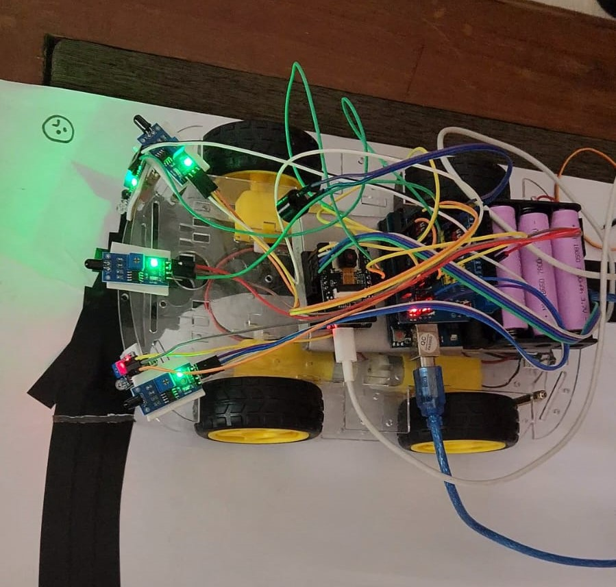

# Multifunctional FireGuard Bot

An ESP32-CAM and Arduino-based multifunctional robotic system for fire detection, line following, obstacle avoidance, Wi-Fi remote control, and AI-assisted navigation.

## Features

- Fire and flame detection
- Line following
- Obstacle avoidance
- ESP32-CAM live video streaming
- Wi-Fi-based manual control
- Emergency stop system
- YOLO-based obstacle detection
- Arduino and ESP32-CAM dual-controller architecture

## System Architecture

The robot uses:

- Arduino Uno for sensor reading and low-level control
- ESP32-CAM for Wi-Fi, camera streaming, motor control, and web interface
- L298N motor driver for DC motor control
- Flame sensors for fire detection
- IR sensors for line following
- YOLO and OpenCV for AI-assisted navigation

## Hardware Components

- ESP32-CAM
- Arduino Uno
- L298N motor driver
- Four DC gear motors
- Flame sensors
- IR sensors
- Active buzzer
- 18650 Li-ion batteries
- 4WD robot chassis

## Operating Modes

1. Manual Mode
2. Line Following Mode
3. Fire Detection Mode
4. YOLO AI Navigation Mode

## System Diagram







## Demonstration Videos

### Fire Detection

- [Fire Detection Video 1](media/videos/Fire_detection_1.mp4)
- [Fire Detection Video 2](media/videos/Fire_detection_2.mp4)

### Line Following

- [Line Following Video](media/videos/Line_Following.mp4)

### Obstacle Detection

- [Obstacle Detection Video 1](media/videos/Obstacle_detection_1.mp4)
- [Obstacle Detection Video 2](media/videos/Obstacle_detection_2.mp4)
- [Obstacle Detection Video 3](media/videos/Obstacle_detection_3.mp4)
- [YOLO Obstacle Detection Video](media/videos/Obstacle%20Detection%20With%20YOLO00018928%20ScreenCast.mov)

## Pin Information

### Arduino Uno

| Component | Pin |
|---|---|
| Buzzer | D3 |
| IR Sensor 1 | D4 |
| IR Sensor 2 | D5 |
| Flame Sensor 1 | D6 |
| Flame Sensor 2 | D7 |
| Flame Sensor 3 | D8 |

### ESP32-CAM

The ESP32-CAM controls the motors, camera stream, Wi-Fi web server, and remote commands.

## Installation

### Arduino Code

1. Open `firmware/arduino/arduino_code.ino` in Arduino IDE.
2. Select Arduino Uno as the board.
3. Connect the Arduino Uno.
4. Upload the code.

### ESP32-CAM Code

1. Open `firmware/esp32-cam/esp32_cam_code.ino`.
2. Select the correct ESP32-CAM board.
3. Connect the ESP32-CAM using a USB-to-TTL adapter.
4. Upload the code.
5. Connect to the Wi-Fi network named `FireBot`.
6. Open the following address in a browser:

```text
http://192.168.4.1
```

### YOLO Navigation

Install the required Python packages:

```bash
pip install -r software/requirements.txt
```

Run the navigation program:

```bash
python software/yolo_navigation.py
```

The laptop and ESP32-CAM should be connected to the same `FireBot` Wi-Fi network.

## Repository Structure

```text
multifunctional-fireguard-bot/
│
├── README.md
├── LICENSE
├── .gitignore
│
├── firmware/
│   ├── arduino/
│   │   └── arduino_code.ino
│   └── esp32-cam/
│       └── esp32_cam_code.ino
│
├── software/
│   ├── yolo_navigation.py
│   └── requirements.txt
│
├── hardware/
│   ├── diagram.png
│   ├── flowchart.jpeg
│   └── prototype.jpeg
│
├── media/
│   ├── gifs/
│   └── videos/
│
└── docs/
    ├── Multifunctional_FireGuard_Bot_Report.pdf
    ├── Budget.pdf
    ├── CEP_Mapping.pdf
    ├── Gantt_Chart.pdf
    ├── Team_Contributions.pdf
    └── Code_Reference.pdf
```

## Project Documents

- [Final Project Report](docs/Multifunctional_FireGuard_Bot_Report.pdf)
- [Project Budget](docs/Budget.pdf)
- [CEP Mapping](docs/CEP_Mapping.pdf)
- [Gantt Chart](docs/Gantt_Chart.pdf)
- [Team Contributions](docs/Team_Contributions.pdf)
- [Code Reference](docs/Code_Reference.pdf)

## Safety Note

This is an academic prototype, not a certified firefighting or life-safety device. Do not test it near people, valuable property, or uncontrolled fire.

The Remote Control and motor systems should be tested carefully. Use proper electrical isolation and never work with exposed electrical connections while the system is powered.

## Team

- Md. Osman Goni
- Aeysha Tabassum
- Arannamoy Mondal
- Fabia Akter Borsha

## License

This project is licensed under the MIT License.
